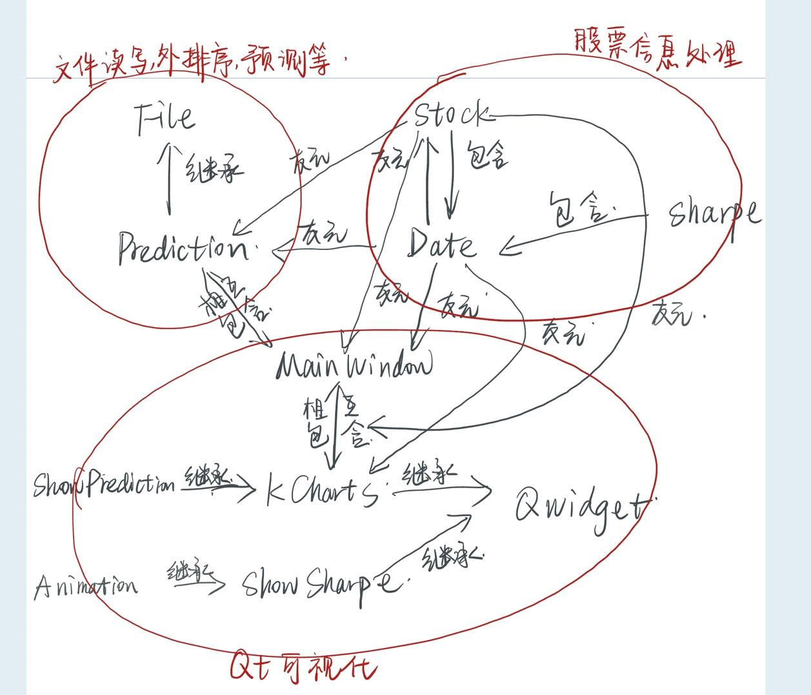
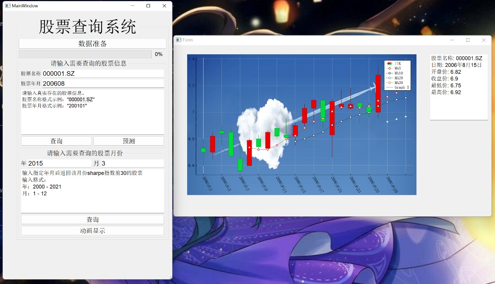
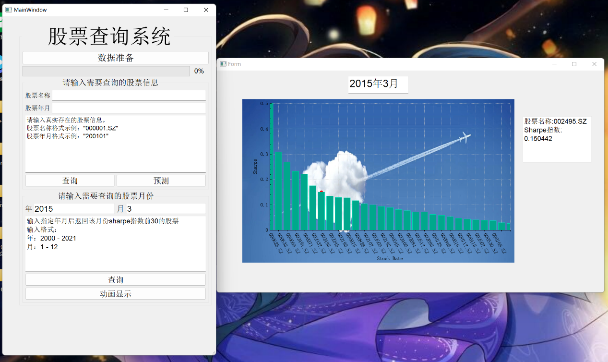
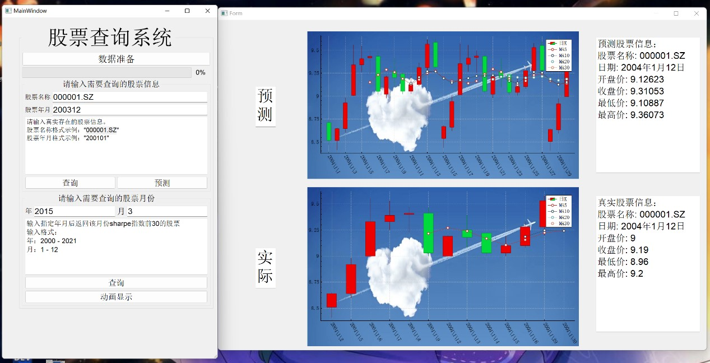
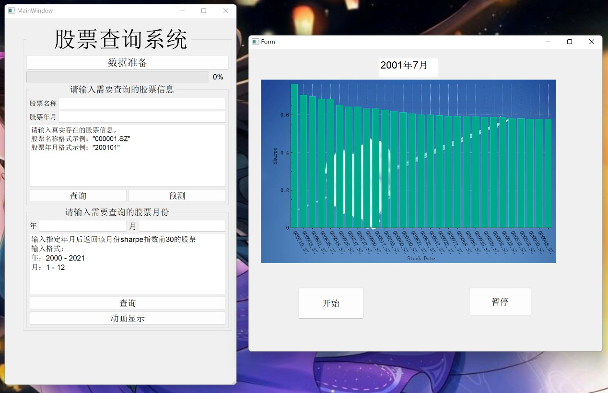

> **实验报告**

**注：请将数据源文件命名为source_file.csv放入source/file/ 文件夹中**

**类与类之间的关系**

**类的主要成员与对外接口**

**1、Date 类**

数据成员：int 类型：年、月、日

成员函数：get_info(), get_str()：返回日期相关信息。

> ++, ==, \<重载：对股票信息排序、夏普指数同月份判等、股票预测下月份真实信息返回。

**2、Stock类**

数据成员：string对象：股票名称

> Date 对象：股票日期
>
> double 类型：股票开盘价、收盘价、最高价、最低价等信息

**成员函数：**

> get_str(), get_info(string), get_info()：对外返回股票的信息。
>
> \<重载：对股票进行排序。

3.Sharpe类

数据成员：string对象：股票名称

Date对象：股票日期

double类型：差分值、平均值、标准差、夏普指数

成员函数：\<，==重载：对股票的夏普指数排序，同月份股票判等。

get_diff(), get_info(), get_shp(): 对外返回股票信息。

**4、File类**

数据成员：

fstream对象：源数据文件读写

string类型的vector：存取分写小文件的文件名

pair\<Stock,int\>类型的小根堆：k路归并，pair存取股票与其小文件的编号

\<string,long long\>类型的哈希表：存取某年月某股票在排序完文件中的偏移量

成员函数：

> get_stock(string), get_stock(string, string)：通过提供的股票信息返回一个存着Stock对象的vector。

对外接口：

write(MainWindow\*)：传入MainWindow对象的指针，将原文件分别写入10个小文件并进行文件内部的飘絮，每写入一个小文件，更新一次进度条。

Sort(MainWindow\*)：传入MainWindow对象的指针，将写入的10个小文件进行排序。运用K路归并的思想，将未写完的文件中最小的股票加入优先队列中，每次将队头弹出，并将该文件的下一只股票加入优先队列中，每排完一个小文件更新以此进度条。

set_index()：打开排好序的文件，将文件指针的偏移量与每只股票的名称与年月相对应，建立哈希表。

get_index(string,string)：输入股票的名称与年月返回股票在排序后文件中的偏移量。

**5、Prediction类**（继承于File类）

数据成员：

Sharpe类型的vector：存取某年月某股票的夏普指数

\<string,int\>类型的哈希表：存取某年月某股票在stock中的偏移量

成员函数：

predict(string,queue\<Stock\>)：通过线性回归返回某股票某信息的预测值。

对外接口：

get_prediction(queue\<Stock\>, queue\<Stock\>)：传入队列q包含本月股票数据，用于预测下个月股票的数据与队列p包含下个月真实数据。返回一个vector包含下个月30天的股票数据的预测值。

get_index()：返回index

getstock()：返回stock

get_diff(MainWindow\*)：传入MainWindow对象的指针，通过排序后的文件写出差分文件，每写入对应数量数据就更新一次进度条。

get_sharpe()：通过差分文件计算 某年月某股票的sharpe指数写入stock中，并对其进行排序与去重。

**6、MainWindow 类**

数据成员：double类型：time传入数据准备的函数中更新进度条

fstream对象：判断数据是否已经准备

Prediction对象：将两个偏移量对应的哈希表载入内存与数据准备

> double类型QVector：保存每个月前30股票的夏普指数用于画图

成员函数：ShowStock()，ShowSharpe()，PredictNextMonth()：对应三个可视化任务，创建对应类的对象并画图。

DateSet()：数据准备

**7、KChart类**

数据成员：

> QCustomPlot类型的指针，用于画图
>
> QCPItemTracer类型的指针，鼠标移动事件，实时显示该股票某日具体数据。

成员函数：

> setupIndexDemo(QCustomPlot \*customPlot, QVector\<Stock\>)：传入股票数据，画出K线图。

**8、ShowSharpe类**

数据成员：

> QCustomPlot类型的指针，用于画图
>
> double类型的QVector：存入夏普指数
>
> QString类型的QVector：存入夏普指数对应的股票名称
>
> QCPItemTracer类型的指针，鼠标移动事件，实时显示该股票某月的夏普指数

**9、ShowPrediction类**（继承于KChart类）

数据成员：

> QCustomPlot类型的指针，用于画预测股票的K线图与实际股票的K线图。
>
> QCPItemTracer类型的指针，鼠标移动事件，实时显示该股票某日预测数据与实际数据。

**10、Animation 类**（继承于ShowSharpe类）

数据成员：

Date类型对象：循环左右哨兵

QTimer类型的指针：用于控制循环开始与结束

**任务实现策略与算法思路**

**3-1外排序**

主要数据结构与算法：二叉堆、K路归并

算法思路：首先将原文件写入10个小文件中并将其排序，之后将每个小文件中最小的股票与小文件的编号插入优先队列中，每次将优先队列队头弹出并写入输出文件中，并将此文件中下一支股票插入优先队列中，直至优先队列为空。每次完成小文件排序或单个文件排序完成就更新进度条。

**3-2加快数据访问**

主要数据结构与算法：哈希表

算法思路：将排序后的文件打开，遍历每一只股票信息，若股票名称与年月与前一支股票不同，则将股票名称与年月与文件指针的位置记入哈希表中。每次访问时，提供股票的名称与年月信息，返回文件中该股票的位置，以加快数据的访问。

**3-3对股票价格**

算法思路：在MainWindow中输入需要查询的股票名称与年月，通过哈希表快速定位股票信息的位置，将股票信息以vector形式返回，并以此建立一个KChart对象，显示该支股票在某年某月的K线图。

运行结果：

**3-4指标计算**

主要数据结构与算法：排序与去重，哈希表

算法思路：首先将排序后的文件打开，将last为上一支股票，str为这一支股票。当两只股票信息相同时，计算差分值eps，并将股票名称、年月与差分值写入diff.txt文件中，每次写入一定量数据就更新进度条。再打开diff.txt文件，将相同股票的差分值取出，计算平均值、标准差与该股票该月的夏普指数并插入stock这个vector中，再对stock进行排序去重后将其载入内存。之后再依据stock计算出某年月在stock中的偏移量并将该年月与偏移量记入index中。

**3-5查询某个月夏普指数前30的股票**

算法思路：在MainWindow中输入需要查询的年月，通过index返回偏移量在stock中取出数据，以此创建一个ShowSharpe对象，显示某月夏普指数的柱状图。

**注**：为能较好地显示出各个月份前30的夏普指数，将夏普指数大于10的极端值进行了过滤

运行结果：

**3-6 预测价格变动**

主要数据结构与算法：队列，线性回归

算法思路：在MainWindow中输入需要预测的股票名称与年月，通过get_stock(string,string)接口返回一个vector包含该股票此月数据，再将这个vector转化为队列作为数据队列。之后再插入此股票在此月之后的30条数据到实际队列中。在预测过程中，将利用数据队列中的股票信息预测出下一天的股票信息，将预测出的股票信息插入预测队列中，并将数据队列队头弹出，将实际队列的队头插入数据队列的队尾，以此往复，预测出该股票下个月每天的数据。

运行结果：

3-7动画显示夏普指数前30

算法思路：运用一个循环变量date从2000/09开始，到2021/12月为终点，不断展示date日期夏普指数前30的股票。用一个QTimer变量来控制循环的开始与结束，将start()与stop()接口与两个button相绑定，实现间断与继续。

运行结果：

